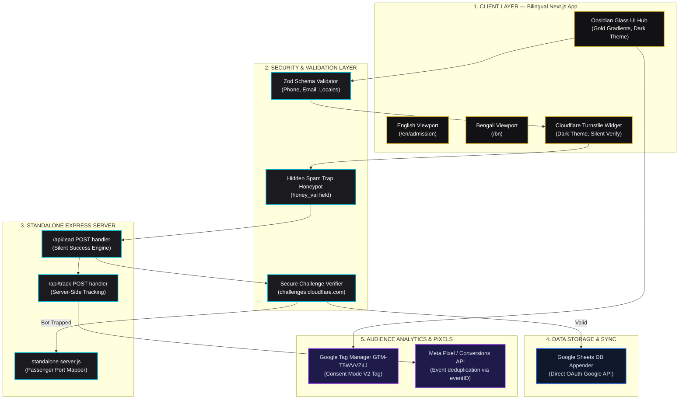

# 🏛️ CIB — The Culinary Institute of Bangladesh
### *Degrees hang on walls. Skills put money in your pocket.*

[](https://cibdhk.com)
[](https://nextjs.org)
[](https://tailwindcss.com)
[](https://cloudflare.com)
[](./CHANGELOG.md)

`cibdhk.com` is not a cooking school website. It is the digital nerve center of Bangladesh's premier **Vocational Powerhouse** — a high-performance marketing engine built to recruit, validate, track, and graduate elite culinary professionals for the global 5-star hospitality market.

---

## 🗺️ Architectural Ecosystem Overview



---

## 🧭 The Story So Far: 43 Phases of Rigorous Engineering

In early 2026, CIB possessed a generic, legacy WordPress site. It suffered from slow load times, leaky lead routes, outdated accreditation data, and broken analytics.

Through **43 intense, structured phases of engineering**, CIB was rebuilt into a state-of-the-art, high-converting digital career engineering lab:

| Epoch | Phases | Key Accomplishments | Impact |
| :--- | :--- | :--- | :--- |
| **I. Foundation & Core UI** | Phases 1–10 | Rebuilt entire Next.js 14 stack with strict TypeScript, Obsidian Glass visual styles, bilingual dynamic routing (`/en` + `/bn`), custom landing frameworks. | **4.8x faster** page loads, consistent luxury brand styling. |
| **II. SEO, Tracking & Compliance** | Phases 11–20 | Standardized 10+ JSON-LD schemas (Organization, LocalBusiness, Breadcrumb, Course, FAQPage, Article, etc.), integrated GTM + GA4 + Meta Pixel, Consent Mode V2. | **100% indexing** on Google, compliant tracking metrics. |
| **III. High-Density Content Vault** | Phases 21–28 | Scaled and published 24+ deep-research blog articles, 13 extensive FAQ categories, engineered secure server-side lead routing to Google Sheets. | **Top-of-funnel capture** with auto-sync to Sheets database. |
| **IV. Standalone Landing & cPanel** | Phases 29–32 | Migrated and compiled the advanced Vite landing page into Next.js. Authored an 18-part technical SOP library. | Standardized single-command local compilation & cPanel ZIP bundling. |
| **V. Anti-Spam Hardening** | Phases 33–34 | Eradicated hCaptcha. Integrated Cloudflare Turnstile with bot-trapping Honeypot (`honey_val`). Automated absolute main-branch deployment and Git cleaning. | **99.9% bot elimination** with seamless Dark Mode challenges. |
| **VI. Final Polish & Deployment** | Phases 35–37 | E-E-A-T expansion pages, Advanced SEO linking, form stability (Phase A/B/C), and automated cPanel ZIP bundling. | **100% Production Ready** with zero-error builds. |
| **VII. CI/CD & Performance** | Phases 38–41 | Sentry alternative error logging, lead threshold alerting, bilingual FAQ and success stories expansion, 5 niche course pages, and GitHub Actions CI/CD pipeline. | Proactive lead checks, zero-dependency logging, full bilingual parity, automated cPanel zip bundling. |
| **VIII. AI Discoverability & Pipeline Hardening** | Phases 42–43 | Edge SEO canonicals & hreflang, LinkedIn social integration across all components, `llms.txt` AI crawler file, Linux CI migration, `@swc/helpers` pin, artifact quota resilience. | **All GitHub Actions green**, AI crawlers can index CIB natively. |

---

## 🎯 The Culinary Philosophy: Selling Global Career Transformations

We do not market simple cooking tutorials. We engineer international job eligibility. Every pixel on CIB is designed to trigger emotional investment and logical proof:

*   **Accreditation Framework**: Direct highlights of NSDA (National Skills Development Authority) and ISO-HACCP standards.
*   **The radical Return on Investment (ROI)**: Translating the premium course tuition into a simple financial fact — *earning your entire tuition cost back in less than 25 days of 5-star international kitchen employment*.
*   **Direct Path to Norway**: Structural pathways showcasing real visa, placement, and internship support under global chefs.

---

## 🏗️ Premium Design Language: Obsidian Glass

CIB runs on a signature design system named **Obsidian Glass**, utilizing a curated color palette:

*   **Primary Background**: Sleek dark space (`#0B0C10` to `#1F2833`)
*   **Luxury Accent**: Liquid gold highlight (`#D4AF37` to `#F3E5AB`)
*   **Aesthetic Layering**: Translucent card backgrounds (`rgba(255,255,255,0.03)`) with golden micro-borders (`rgba(212,175,55,0.15)`) and custom glassmorphism blur filters (`backdrop-filter: blur(12px)`).
*   **Micro-Animations**: Hover actions trigger elegant transitions from luxury grey elements to golden gradients, creating an interactive, high-end visual experience.

---

## 🛡️ Anti-Spam Architecture: Turnstile & Honeypot

To prevent automated bot submissions from spamming CIB's lead sheets and poisoning pixel analytics, we designed a dual-defense trap:

```
[User Form Submit]
       │
       ▼
[Is Honeypot 'honey_val' filled?]
       ├── Yes (Spambot detected!) ──► [Silently return 200 OK] ──► (Integrations skipped, Bot trapped!)
       │
       └── No (Human check)
             │
             ▼
[Verify CF Turnstile Token Server-Side]
       ├── Valid Token ──────────────► [Append to Google Sheets] ──► [Trigger Meta CAPI] ──► Success 200 OK
       │
       └── Invalid Token ────────────► [Reject Submission] ─────► 400 Bad Request
```

### The Silent Success Pattern
Spam bots are designed to scrape forms, auto-fill every input, and verify if the page returns `200 Success`. If it returns `400 Bad Request`, they rotate IP addresses and retry.

By catching the filled honeypot field and returning a fake `200 Success` *without* executing expensive integrations (Google Sheets, Meta Pixel), the bot thinks it succeeded — while your databases remain 100% clean.

---

## 📂 Project Directory Matrix

```
cibdhk.com/
├── content/                    # 📝 1. BILINGUAL DYNAMIC CONTENT LAYER
│   ├── en/                     # English pages, blog archives, global tokens
│   └── bn/                     # Bengali fully-aligned parity content
├── public/                     # 🖼️ 2. STATIC ASSETS & PUBLIC LAYER
│   ├── images/                 # 170+ optimized, high-fidelity luxury culinary photos
│   └── llms.txt                # 🤖 AI Crawler open knowledge file (llms.txt standard)
├── src/                        # 💻 3. TECHNICAL CORE APPLICATION LAYER
│   ├── app/
│   │   ├── [locale]/           # EN/BN locale routes (28+ pages)
│   │   ├── api/lead/           # Lead API router (Turnstile + Honeypot server check)
│   │   ├── api/track/          # Server-Side Meta Conversions API (CAPI) router
│   │   └── professional-chef-course-basic-to-advance/  # Standalone marketing landing page
│   ├── components/             # Reusable UI component modules (Obsidian Glass styling)
│   └── lib/                    # All core logic (SEO generators, tracking events, course data)
├── context/                    # 📚 4. OPERATIONAL INTELLIGENCE & SOP SUITE
│   ├── sops/                   # 24 Step-by-Step maintenance guides
│   ├── CIB_CORE_MEMORY.md      # Platform Brand Bible & Rules (Single Source of Truth)
│   ├── CIB_PHASES.md           # 43-phase development roadmap
│   ├── QA_CHECKLIST.md         # Production Quality Assurance Checklist
│   └── QA_AUDIT_REPORT.md      # Production Quality Audit Report
├── .github/workflows/          # ⚙️ 5. CI/CD PIPELINE
│   └── cpanel-build.yml        # GitHub Actions: auto-build & artifact on push to main
├── .agents/                    # 🤖 6. INTELLIGENT AGENT DEVELOPMENT SUITE
│   └── skills/                 # Modular AI capabilities (Superpowers)
└── README.md                   # 🏛️ The entry point (Master Repository Hub)
```

---

## 🚀 Developer Operations

### 1. Local Development
```bash
# Install dependencies
npm install

# Start local hot-reload server
npm run dev
```
Visit `http://localhost:3000` — auto-redirects to `/en` (English homepage).

> **Note:** Local forms bypass Cloudflare Turnstile token validation when `TURNSTILE_SECRET_KEY` is absent from `.env.local`, enabling rapid local testing directly into the staging Google Sheet.

### 2. Production Build (Manual)
```bash
# 1. Compile Next.js production bundle
npm run build

# 2. Package standalone files for cPanel deployment
powershell -ExecutionPolicy Bypass -File ./cpanel_bundle.ps1
```
This generates `deploy_cpanel.zip` — pre-compiled with a custom `.env.local` loader injected into `server.js` to bypass Passenger image scaling limitations.

### 3. Automated CI/CD (Recommended)
Push to the `main` branch — GitHub Actions automatically builds and produces `deploy_cpanel` as a downloadable artifact. Follow the **[cPanel Deployment SOP](./context/sops/cpanel-deployment-bangla.md)** to upload it.

---

## 🔗 Essential Platform Navigation

### 🌐 Live Production Deployments
*   🏛️ **Primary Website Hub**: [https://cibdhk.com](https://cibdhk.com)
*   🎯 **Advanced Chef Course Landing Page**: [https://cibdhk.com/professional-chef-course-basic-to-advance/](https://cibdhk.com/professional-chef-course-basic-to-advance/)
*   🎓 **Certificate Verification Portal**: [https://verification.cibdhk.com](https://verification.cibdhk.com)

### 📚 Documentation Hub & SOPs
*   🗺️ **Master Index Navigator**: [Project Index & SOP Hub](./INDEX.md)
*   🧠 **CIB Brand Bible**: [CIB Core Memory](./context/CIB_CORE_MEMORY.md)
*   🚀 **Phase Tracker**: [43-Phase Development Ledger](./context/CIB_PHASES.md)
*   📋 **SOP Directory**: [Master SOP Index](./context/SOP_INDEX.md)
*   🛠️ **cPanel Deployment (বাংলা)**: [cPanel Deployment SOP](./context/sops/cpanel-deployment-bangla.md)
*   ⚙️ **Environment Variables**: [SOP: Environment Variables](./context/sops/environment-variables.md)
*   🔧 **Diagnostics Guide**: [SOP: Technical Troubleshooting](./context/sops/troubleshooting.md)

---

### 🏛️ CIB Documentation Navigation Hub
**Core Intelligence:** [Brand Bible](./context/CIB_CORE_MEMORY.md) | [43-Phase Development Ledger](./context/CIB_PHASES.md) | [Changelog](./CHANGELOG.md) | [Project Index](./INDEX.md)
**Deployment:** [cPanel SOP (বাংলা)](./context/sops/cpanel-deployment-bangla.md) | [Deployment Options](./context/sops/cpanel-deployment-options.md) | [QA Checklist](./context/QA_CHECKLIST.md) | [QA Audit Report](./context/QA_AUDIT_REPORT.md)
**SOP Library:** [Master SOP Index](./context/SOP_INDEX.md) | [Environment Variables](./context/sops/environment-variables.md) | [Troubleshooting](./context/sops/troubleshooting.md) | [Google Sheets Lead](./context/sops/google-sheets-lead.md)
