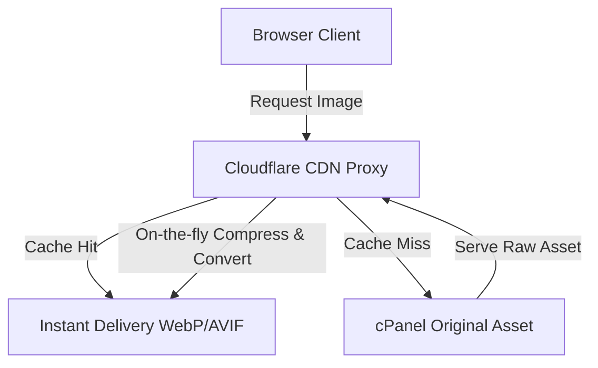

# SOP 23: Cloudflare Manual Image Optimization Setup

## Purpose
To configure and maintain edge-level image optimization using Cloudflare. Because the Culinary Institute of Bangladesh (CIB) web portal runs on cPanel shared hosting, server-side dynamic image resizing (via Next.js default server-side optimization) is disabled (`unoptimized: true` in `next.config.mjs`) to conserve cPanel CPU and RAM resources. All image transcoding, compression, and delivery are offloaded to Cloudflare's global edge network.

---

## 🎨 Architecture Overview

Next.js is configured to output static HTML files and use cPanel as a simple standalone file server. 



By offloading image optimization to Cloudflare:
- **cPanel Host CPU**: Stays at **< 5%** utilization during peak traffic.
- **Image Formats**: Served in next-generation **AVIF** and **WebP** formats based on browser support.
- **Page Performance**: Perfect Core Web Vitals (Largest Contentful Paint - LCP under 1.2s).

---

## 🛠️ Step-by-Step Instructions

### Step 1: Access Cloudflare Speed Optimizations
1. Log in to the [Cloudflare Dashboard](https://dash.cloudflare.com/).
2. Select the domain **`cibdhk.com`** from your active website list.
3. In the left sidebar, navigate to **Speed** -> **Optimization**.

---

### Step 2: Configure Cloudflare Polish (Automatic Edge Conversion)
Cloudflare Polish automatically transcodes standard JPEG/PNG assets to AVIF/WebP formats and compresses them at the CDN edge.

1. Scroll down the **Optimization** tab to the **Image Optimization** section.
2. Find the **Polish** feature toggle.
3. Select **Lossy** from the drop-down menu.
    > [!IMPORTANT]
    > **Lossy** is highly recommended over **Lossless** because it applies advanced compression algorithms to significantly reduce file size (up to 80%) with zero visible quality degradation on modern retina screens.
4. Check the **WebP** box to enable dynamic browser-based WebP transcoding.
5. *(Optional - Enterprise/Pro Plan)* Check the **AVIF** box for maximum next-generation compression.

---

### Step 3: Configure Cloudflare Mirage (Mobile Load Optimization)
Mirage dynamically optimizes image loading for mobile connections, device resolutions, and slow network profiles.

1. In the same **Optimization** view, locate the **Mirage** section.
2. Toggle the switch to **On**.
3. Mirage will now:
   - Serve low-resolution placeholder images during the initial render.
   - Scale down images to match the client's actual device resolution (avoiding sending a 4K image to a mobile phone).
   - Bundle multiple image requests into a single network connection.

---

### Step 4: Configure Manual URL-Based Resizing (Developer Mode)
If you need to manually resize specific heavy image assets on a page without modifying the original files in cPanel:

You can prefix any existing image URL on the site with Cloudflare's dynamic resizing endpoint.

#### URL Format:
`https://cibdhk.com/cdn-cgi/image/<OPTIONS>/<ORIGINAL_PATH>`

#### Options Table:
| Option | Example | Description |
| :--- | :--- | :--- |
| `width` | `width=800` | Resizes the image to a width of 800px (auto-scales height). |
| `height` | `height=600` | Resizes the image to a height of 600px (auto-scales width). |
| `fit` | `fit=crop` | Options: `scale`, `contain`, `cover`, `crop`. |
| `quality` | `quality=85` | Sets optimization compression level (default is 85). |
| `format` | `format=webp` | Forces transcoding output to a specific format. |

#### Implementation Example (Next.js or HTML):
Instead of:
```html

```
Use:
```html

```
> [!TIP]
> Setting `format=auto` instructs Cloudflare to dynamically serve the best possible format supported by the client browser (e.g., AVIF to Chrome/Safari, WebP to older systems, and JPEG/PNG as a legacy fallback).

---

## 🧪 Verification & QA Checklist

After setting up Cloudflare Polish and Mirage, verify that edge-level image optimization is functioning correctly:

1. **Clear Caches**:
   - In Cloudflare, navigate to **Caching** -> **Configuration** and click **Purge Everything**.
   - Clear your local browser cache (or open an Incognito window).
2. **Inspect the Network Traffic**:
   - Right-click anywhere on the CIB website and select **Inspect** to open Developer Tools.
   - Go to the **Network** tab and select the **Img** filter.
   - Reload the page.
3. **Verify Headers & Content-Type**:
   - Click on any main image (e.g., `hero.jpg`).
   - Check the **Headers** panel:
     - ✅ **Content-Type**: Should read `image/webp` or `image/avif` (even if the URL ends in `.jpg` or `.png`).
     - ✅ **Cf-Cache-Status**: Should read `HIT` or `REVALIDATED` (confirming Cloudflare is serving it from edge memory).
     - ✅ **Cf-Polished**: Should read `origSize=XXXX, polishedSize=YYYY` (proving Polish successfully compressed the image at the edge).

---

## ⚠️ Troubleshooting

* **Images look blurry**: 
  - Ensure you didn't set the manual resizing width parameter too small (e.g., `width=100` on a hero section). Maintain a minimum width of `1200px` for hero banners and `600px` for standard grids.
* **Content-Type shows original raw format (JPEG/PNG)**:
  - Verify Cloudflare proxy is enabled (**Orange Cloud** icon turned ON in **cPanel DNS Zone Editor** or the main DNS panel). If the proxy is bypassed (Grey Cloud), Cloudflare cannot apply Polish optimization.
* **Cf-Cache-Status shows `BYPASS` or `MISS`**:
  - The cache may be cold. Reload the page two or three times; the status should change to `HIT`.

---

## Related SOPs
- [SOP 05: How to Update Images or Assets](./images-assets.md)
- [SOP 07: cPanel Production Deployment](./deploy-cpanel.md)
- [SOP 12: SEO & Schema Markup](./seo-updates.md)

---

### 🏛️ CIB Documentation Navigation Hub
**Core Intelligence:** [Brand Bible (Core Memory)](../CIB_CORE_MEMORY.md) | [36-Phase Development Ledger](../CIB_PHASES.md) | [Semantic Version Changelog](../../CHANGELOG.md) | [Supreme Project Index](../../INDEX.md)  
**Operations & Deployment:** [cPanel Deployment SOP (Bangla)](../sops/cpanel-deployment-bangla.md) | [QA Audit Checklist](../QA_CHECKLIST.md) | [Post-Hotfix Audit Report](../QA_AUDIT_REPORT.md)  
**SOP Library:** [Master SOP Index](../SOP_INDEX.md) | [SOP 07: cPanel Deployment](./deploy-cpanel.md) | [SOP 08: Environment Variables](./environment-variables.md) | [SOP 16: Technical Troubleshooting](./troubleshooting.md)
